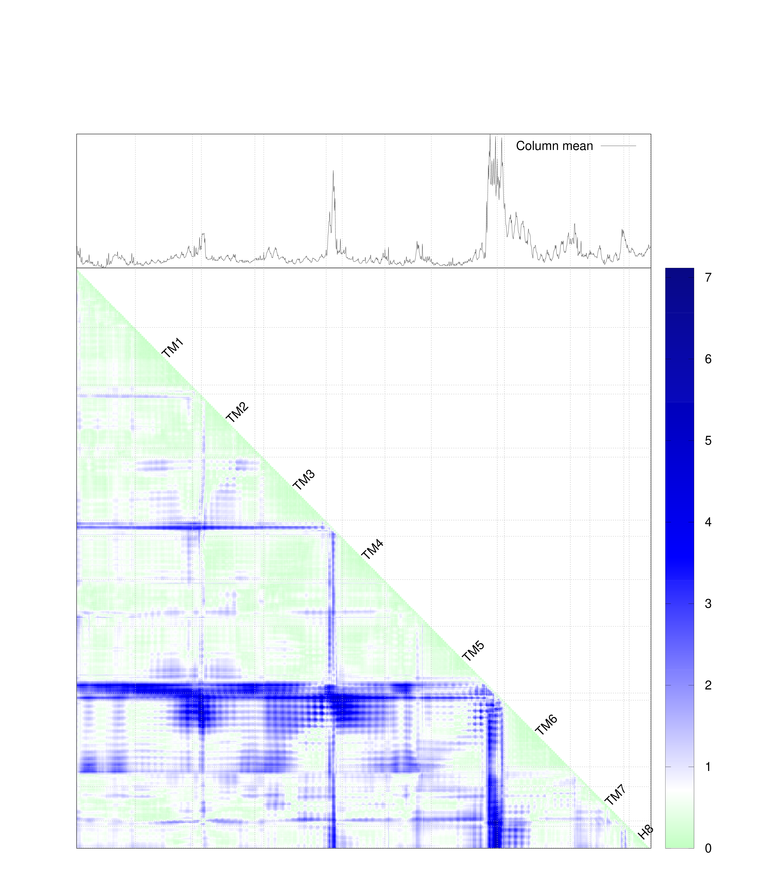

<!-- What is this for? -->

## Get started with `pyrotein`

A tiny package for structure analysis of macromolecules.  Atomic coordinates
retrieved from a PDB file are stored in two formats: **list** and
**dictionary**.  So you can create your own methods on top of either format.
This package provides structure analysis capability based on distance matrix.


## Install with `pip`

```
pip install pyrotein --user
```


<!-- Why it might be a good choice? -->

<!-- Minimal dependency -->

## Dependencies

This package has only one dependency -- [`numpy`](https://numpy.org/).  

### Why this package doesn't come with a visualization tool?

You can create graphics using your preferred visualization tools.  For
simplicity, it's a design choice not to include a specific visualization library
in `pyrotein`.  However, examples of using `Gnuplot` and `matplotlib` are
included in the `examples` directory.  

The colorschemes used in RMSD distance matrix and SVD analysis are inspired by
[this paper](https://academic.oup.com/nar/article/44/15/7457/2457750) from Zhong Ren.  

## Structure analysis workflow

### Import the library

```Python
import pyrotein as pr
```

### Load a PDB structure

The following code snippet loads a PDB file `6cmo.pdb` under `pdb` directory.  

```Python
import pyrotein as pr
import os

# Read coordinates from a PDB file...
drc       =  "pdb"
pdb       =  "6cmo"
fl_pdb    = f"{pdb}.pdb"
pdb_path  = os.path.join(drc, fl_pdb)
atoms_pdb = pr.atom.read(pdb_path)
```

### Create a lookup table to navigate the molecule

The method `pr.atom.read` returns molecular information encapsulated in a Python
List.  However, a lookup table can be very handy for tasks such as accesssing a
particular atom `CA` from residue `1002` in chain `A`.  The following example
shows how to achieve it using lookup table.

#### Access an atom

```Python
# Create a lookup table for this pdb...
atom_dict = pr.atom.create_lookup_table(atoms_pdb)

# Demo: Access atom `CA` from residue 1002 in chain A
atom_dict["A"][1002]["CA"]
```

#### Select a segment by range

The following example demos how to select a segment of protein that represents
visual rhodopsin from entry `6cmo`.  

```Python
# Create a lookup table for this pdb...
atom_dict = pr.atom.create_lookup_table(atoms_pdb)

# Fetch residues that form rhodopsin...
chain = "A"
nterm = 1
cterm = 348
rho_dict = pr.atom.extract_segment(atom_dict, chain, nterm, cterm)
```

## Structure analysis capabilities

### Extract coordinates from a segment

Coordinates of backbone atoms (`N`, `CA`, `C`, `O`) are essential for distance
matrix analysis.  The code below extracts coordinates from a segment of amino
acids, which range from `nterm` to `cterm` in chain `chain`.  

```Python
# Obtain coordinates...
xyzs = pr.atom.extract_backbone_xyz(atom_dict, chain, nterm, cterm)
```

### Distance matrix

```Python
# Calculate distance matrix...
dmat = pr.distance.calc_dmat(xyzs, xyzs)
```

### Root-Mean-Square-Deviation distance matrix

Let's say we are interested in chains specified in the file `chains.dat`.  

```
# chains.dat
6cmo    R
6fk6    A
6fk7    A
6fk8    A
6fk9    A
6fka    A
6fkc    A
6fkd    A
6fuf    A
6nwe    A
6ofj    A
6ofj    B
6oy9    R
6oya    R
6pel    A
6pgs    A
6ph7    A
6qno    R
```

All entries in `chains.dat` have been stored in `pdb` directory.  

The code below accumulates coordinates from chains specified in `chains.dat`.
Don't worry.  You can run the example code under the `examples` directory.  

```Python
import os
import numpy as np
import pyrotein as pr

# Specify chains to process...
drc      = "pdb"
fl_chain = "chains.dat"
lines    = pr.utils.read_file(fl_chain)

# Define the backbone...
backbone = ["N", "CA", "C", "O"]

# Specify the range of atoms from rhodopsin...
nterm = 1
cterm = 348
len_backbone = (cterm - nterm + 1) * len(backbone)

# Initialize the matrix that stores accumulated coordinates...
dmats = np.zeros((len(lines), len_backbone, len_backbone))

# Accumulate coordinates...
for i_fl, (pdb, chain) in enumerate(lines):
    # Read coordinates from a PDB file...
    fl_pdb    = f"{pdb}.pdb"
    pdb_path  = os.path.join(drc, fl_pdb)
    atoms_pdb = pr.atom.read(pdb_path)

    # Create a lookup table for this pdb...
    atom_dict = pr.atom.create_lookup_table(atoms_pdb)

    # Obtain coordinates...
    xyzs = pr.atom.extract_backbone_xyz(atom_dict, chain, nterm, cterm)

    # Calculate individual distance matrix...
    dmat = pr.distance.calc_dmat(xyzs, xyzs)

    # Update the accumulated matrix...
    dmats[i_fl, :, :] = dmat[:, :]

# Calculate RMSD distance matrix...
rmsd_dmat = pr.distance.calc_rmsd_mats(dmats)
```

### Examples

The `examples` directory contains two examples about distance matrix and RMSD
distance matrix.  Two visualization choices are provided via `Gnuplot` and
`matplotlib`.  

Here is an sample figure of a RMSD distance matrix in the `examples` directory.



## Caveats

The warning `RuntimeWarning: Mean of empty slice` is triggered by `np.nanmean`
when the input array has nothing but `np.nan` values.  


<!--

To do:

- SVD analysis

-->
