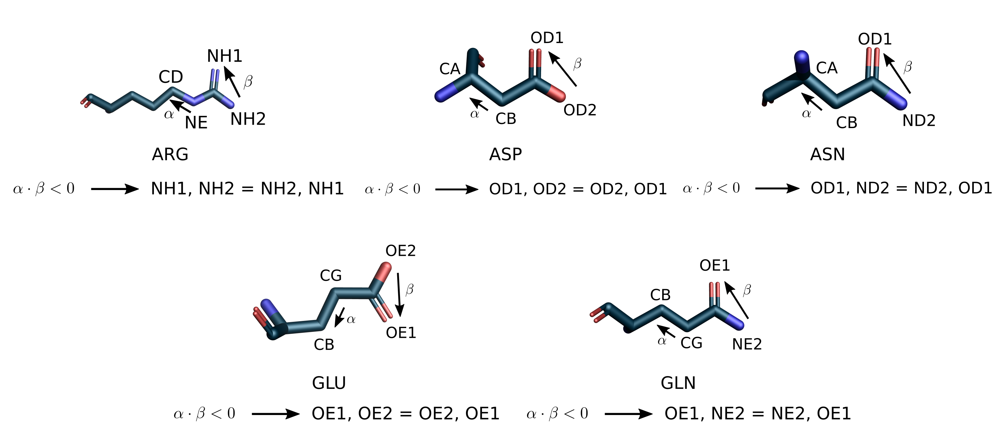
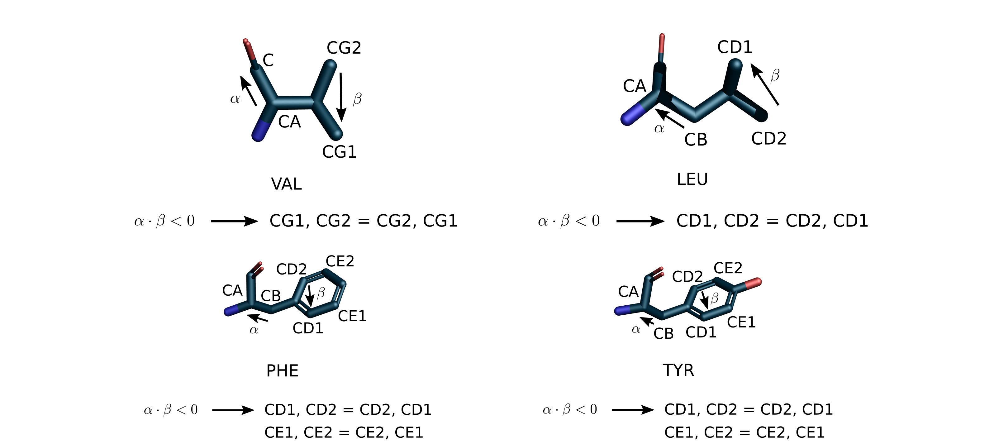

<!-- What is this for? -->

## Get started with `pyrotein`

A tiny package for structure analysis of macromolecules.  Atomic coordinates
retrieved from a PDB file are stored in two formats: **list** and
**dictionary**.  So you can create your own methods on top of either format.
This package provides structure analysis capability based on distance matrix.


## Install with `pip`

```
pip install git+https://github.com/carbonscott/pyrotein --upgrade --user
```

If upgrading doesn't work as expected, run `pip uninstall pyrotein` before
installing it.  


<!-- Why it might be a good choice? -->

<!-- Minimal dependency -->

## Dependencies

This package has only one dependency -- [`numpy`](https://numpy.org/).  

### Why this package doesn't come with a visualization tool?

You can create graphics using your preferred visualization tools.  For
simplicity, it's a design choice not to include a specific visualization library
in `pyrotein`.  However, examples of using `Gnuplot` and `matplotlib` are
included in the `examples` directory.  

The colorschemes used in RMSD distance matrix and SVD analysis are inspired by
[this paper](https://academic.oup.com/nar/article/44/15/7457/2457750) from Zhong Ren.  

## Basic structure analysis capabilities

### Import the library

```Python
import pyrotein as pr
```

### Load a PDB structure

The following code snippet loads a PDB file `6cmo.pdb` under `pdb` directory.  

```Python
import pyrotein as pr
import os

# Read coordinates from a PDB file...
drc       =  "pdb"
pdb       =  "6cmo"
fl_pdb    = f"{pdb}.pdb"
pdb_path  = os.path.join(drc, fl_pdb)
atoms_pdb = pr.atom.read(pdb_path)
```

### Create a lookup table to navigate the molecule

The method `pr.atom.read` returns molecular information encapsulated in a Python
List.  However, a lookup table can be very handy for tasks such as accesssing a
particular atom `CA` from residue `1002` in chain `A`.  The following example
shows how to achieve it using lookup table.

#### Access an atom

```Python
# Create a lookup table for this pdb...
atom_dict = pr.atom.create_lookup_table(atoms_pdb)

# Demo: Access atom `CA` from residue 1002 in chain A
atom_dict["A"][1002]["CA"]
```

#### Select a segment by range

The following example demos how to select a segment of protein that represents
visual rhodopsin from entry `6cmo`.  

```Python
# Create a lookup table for this pdb...
atom_dict = pr.atom.create_lookup_table(atoms_pdb)

# Fetch residues that form rhodopsin...
chain = "A"
nterm = 1
cterm = 348
rho_dict = pr.atom.extract_segment(atom_dict, chain, nterm, cterm)
```

## Establish metadata table

A metadata table keeps track of protein information (PDB, ligand, method, etc).
It is vital in understanding clustering in the SVD analysis stage.  Meanwhile,
the metadata table should be computer readable.  For example, I keep metadata in
a `xlsx` file that can be read by a Python module `openpyxl`.  If you decide to
use the same module, install it by `pip install openpyxl --user`.  Check out
`loaddata.py` in `examples` directory to see how to load data from an `xlsx`
using `openpyxl`.  


## Advanced structure analysis capabilities

`pyrotein` is initially designed to perform distance matrix analysis of protein
structures.  Distance matrix encodes pairwise atomic distance found in a protein
structure.  


### Obtain a distance matrix

#### Main chain only (N, CA, C, O)

```Python
import os
import numpy as np
import pyrotein as pr
from loaddata import load_xlsx, label_TMs
from display import plot_dmat

# Specify chains to process...
fl_chain = "chains.comp.xlsx"
lines    = load_xlsx(fl_chain)
drc      = "pdb"

# Define atoms used for distance matrix analysis...
peptide = ["N", "CA", "C", "O"]

# Specify the range of atoms from adrenoceptor...
nterm = 1
cterm = 322

# The first element is to facilitate the indexing during assignment
len_segments = [ 0,
                 cterm - nterm + 1,
               ]
len_peptide = np.sum(len_segments) * len(peptide)

drc_dmat = "dmats"
pal = "set palette defined ( 0 '#F6FF9E', 0 'white', 0.5 'blue', 1 'navy' )"
for i_fl, line in enumerate(lines[-1]):
    # Unpack parameters
    _, pdb, chain, species = line[:4]
    betatype = line[10]

    # Read coordinates from a PDB file...
    fl_pdb    = f"{pdb}.pdb"
    pdb_path  = os.path.join(drc, fl_pdb)
    atoms_pdb = pr.atom.read(pdb_path)

    # Create a lookup table for this pdb...
    atom_dict = pr.atom.create_lookup_table(atoms_pdb)

    # Obtain coordinates...
    xyzs = pr.atom.extract_xyz_by_atom(peptide, atom_dict, chain, nterm, cterm)

    # Calculate distance matrix...
    dmat = pr.distance.calc_dmat(xyzs, xyzs)

    # It is a common practice to visualize a few distance matrix.  
    # Here is just a way how I use Gnuplot to do so, but you can use
    # your favourite tool to visualize it.  
    fl_dmat = os.path.join(drc_dmat, f"{pdb}.{chain}.dmat")
    plot_dmat(dmat, fl_dmat, lbl = {}, palette = pal, NaN = 0)
```

#### Main chain + side chain

If all atoms in main chain and side chain are your interests, `pyrotein` is
capable of extracting coordinates and build up data correspondence by means of
sequence alignment result (You have to be careful about the result of sequecne
alignment.  It can be problematic).  Sequecne related functionalities are
supposed to be found in `pyrotein.fasta` submodule.  

```Python
import os
import numpy as np
import pyrotein as pr
from loaddata import load_xlsx
from display import plot_dmat

# [[[ OBTAIN THE CONSENSUS SEQUENCE ]]]
# Read the sequence alignment result...
# [WARNING] !!!sequence alignment is not trustworthy
fl_aln   = 'seq.align.fasta'
seq_dict = pr.fasta.read(fl_aln)

# Obtain the consensus sequence (super seq)...
tally_dict = pr.fasta.tally_resn_in_seqs(seq_dict)
super_seq  = pr.fasta.infer_super_seq(tally_dict)


# [[[ FIND SIZE OF DISTANCE MATRIX ]]]
# Get the sequence index (alignment) on the n-term side...
nseqi = pr.fasta.get_lseqi(super_seq)

# User defined range...
nterm, cterm = 1, 322
len_seg = cterm - nterm + 1
super_seg = super_seq[nseqi : nseqi + len_seg]

# Load constant -- atomlabel...
label_dict = pr.atom.constant_atomlabel()
aa_dict    = pr.atom.constant_aminoacid_code()

# [[[ ANALYZE PDB ENTRIES ]]]
# Specify chains to process...
fl_chain = "chains.comp.xlsx"
lines    = load_xlsx(fl_chain, sheet = "Sheet1")
drc      = "pdb"
drc_dmat = "dmats.full"
pal = "set palette defined ( 0 '#F6FF9E', 0 'white', 0.5 'blue', 1 'navy' )"
for i_fl, line in enumerate(lines[-1:]):
    # Unpack parameters
    _, pdb, chain, _ = line[:4]

    # Read coordinates from a PDB file...
    fl_pdb    = f"{pdb}.pdb"
    pdb_path  = os.path.join(drc, fl_pdb)
    atoms_pdb = pr.atom.read(pdb_path)

    # Create a lookup table for this pdb...
    atom_dict = pr.atom.create_lookup_table(atoms_pdb)

    # Obtain the target protein by range...
    tar_seq = seq_dict[f"{pdb}_{chain}"]
    tar_seg = tar_seq[nseqi : nseqi + len_seg]

    # Standardize sidechain atoms...
    pr.atom.standardize_sidechain(atom_dict)

    # Obtain coordinates...
    xyzs = pr.atom.extract_xyz_by_seq(tar_seg, super_seg, atom_dict, chain, nterm, cterm)

    # Calculate distance matrix...
    dmat = pr.distance.calc_dmat(xyzs, xyzs)

    fl_dmat = os.path.join(drc_dmat, f"{pdb}.{chain}.dmat")
    plot_dmat(dmat, fl_dmat, lbl = {}, palette = pal, NaN = 0)
```

Distance matrix that depict both main chain and side chain.


### RMSD distance matrix (for structure alignment)

What can we do by putting all distance matrix together like below?


If you consider a distance matrix is a picture full of pixels, RMSD distance
matrix encodes RMSD of all pixel values at a specific location.  RMSD distance
matrix enables the understanding of rigidity of a protein, that is to say,
smaller deviation means more rigid, and vice versa.  So it can provide a
so-called rigid protein framework for structure alignment.  


Of course, the analysis can be carried out on both main chain only or main +
side chain scenarios.  You can see how much details are captured while
considering both main chain and side chain for each residue.  


### SVD analysis to understand the similarities and differences of protein structures

A significant protein structure analysis `pyrotein` enables is SVD analysis.  An
example code to enable it:

```Python
import numpy as np
import pyrotein as pr
import os
from loaddata import load_xlsx

# [[[ OBTAIN THE CONSENSUS SEQUENCE ]]]
# Read the sequence alignment result...
# [WARNING] !!!sequence alignment is not trustworthy, need to check manually
fl_aln   = 'seq.align.fasta'
seq_dict = pr.fasta.read(fl_aln)

# Obtain the consensus sequence (super seq)...
tally_dict = pr.fasta.tally_resn_in_seqs(seq_dict)
super_seq  = pr.fasta.infer_super_seq(tally_dict)


# [[[ FIND SIZE OF DISTANCE MATRIX ]]]
# Get the sequence index (alignment) on the n-term side...
nseqi = pr.fasta.get_lseqi(super_seq)

# User defined range...
nterm, cterm = 1, 322
len_seg = cterm - nterm + 1
super_seg = super_seq[nseqi : nseqi + len_seg]

# Load constant -- atomlabel...
label_dict = pr.atom.constant_atomlabel()
aa_dict    = pr.atom.constant_aminoacid_code()

# Calculate the total length of distance matrix...
len_dmat = np.sum( [ len(label_dict[aa_dict[i]]) for i in super_seg ] )

# [[[ ANALYZE PDB ENTRIES ]]]
# Specify chains to process...
fl_chain = "chains.comp.xlsx"
lines    = load_xlsx(fl_chain, sheet = "Sheet1")
drc      = "pdb"
## dmats = np.zeros((len(lines), len_dmat, len_dmat))
len_lower_tri = (len_dmat * len_dmat - len_dmat) // 2
dmats = np.zeros((len(lines), len_lower_tri))

# Process each entry...
for i_fl, line in enumerate(lines):
    # Unpack parameters
    _, pdb, chain, species = line[:4]

    print(f"Processing {pdb}_{chain}")

    # Read coordinates from a PDB file...
    fl_pdb    = f"{pdb}.pdb"
    pdb_path  = os.path.join(drc, fl_pdb)
    atoms_pdb = pr.atom.read(pdb_path)

    # Create a lookup table for this pdb...
    atom_dict = pr.atom.create_lookup_table(atoms_pdb)

    # Obtain the target protein by range...
    tar_seq = seq_dict[f"{pdb}_{chain}"]
    tar_seg = tar_seq[nseqi : nseqi + len_seg]

    # Standardize sidechain atoms...
    pr.atom.standardize_sidechain(atom_dict)

    # Obtain coordinates...
    xyzs = pr.atom.extract_xyz_by_seq(tar_seg, super_seg, atom_dict, chain, nterm, cterm)

    # Calculate distance matrix...
    dmat = pr.distance.calc_dmat(xyzs, xyzs)

    # Convert dmat into one-dimensional array and keep it in dmats...
    dmats[i_fl, :] = pr.utils.mat2tril(dmat, offset = -1)

# Replace np.nan with mean across samples...
pr.utils.fill_nan_with_mean(dmats.T, axis = 1)

# SVD...
# Column as example
# Row    as feature
u, s, vh = np.linalg.svd( dmats.T, full_matrices = False )

# Export data for downstream analysis...
np.save("dmats.full.npy" , dmats)
np.save("u.full.npy" , u)
np.save("s.full.npy" , s)
np.save("vh.full.npy", vh)
```

A comparison of left singular values is shown below.  


It also distinguishes entries in the analysis better in main + side chain
scenario.  Check out the follow scatter plot.  (Rotation might require to make
them look better.)


## Thoughts behind building data correspondence

### Standardize sidechain atoms

Sidechain atoms can be interchangeable, such as `NH1` and `NH2` in `ARG`, `OD1`
and `ND2` in `ASN`.  The figure below illustrates the possible ambiguous
scenarios and specifies the swapping rules leading to a standard ordering.  




Sample code to consider sidechain atom standardization.  

```Python
import pyrotein as pr
import numpy as np
import os

# Read atomic information...
pdb       = "1f88"
chain     = "A"
drc_pdb   = "pdb"
fl_pdb    = f"{pdb}.pdb"
path_pdb  = os.path.join(drc_pdb, fl_pdb)
atom_list = pr.atom.read(path_pdb)
atom_dict = pr.atom.create_lookup_table(atom_list)

# Standardize sidechain atoms...
pr.atom.standardize_sidechain(atom_dict)
```


### Examples

The `examples` directory contains two examples about distance matrix and RMSD
distance matrix.  Two visualization choices are provided via `Gnuplot` and
`matplotlib`.  

## Caveats

The warning `RuntimeWarning: Mean of empty slice` is triggered by `np.nanmean`
when the input array has nothing but `np.nan` values.  
